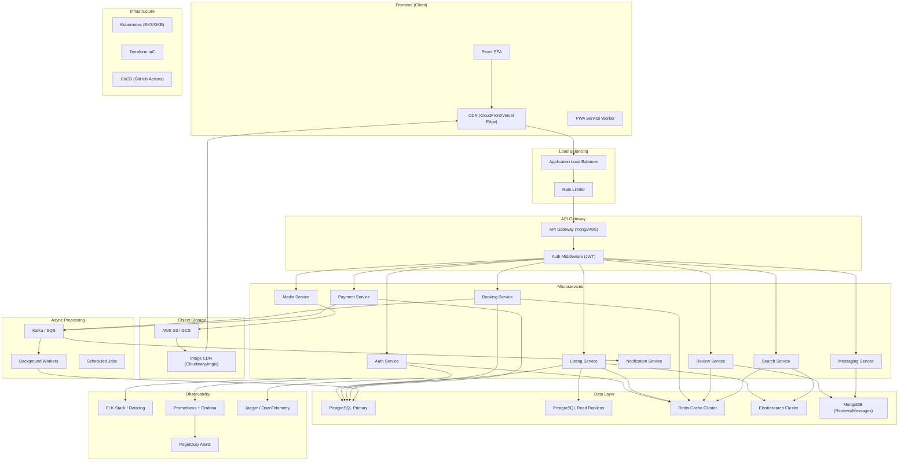
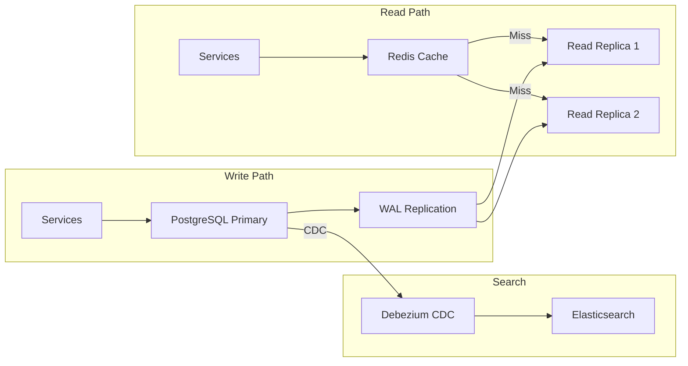
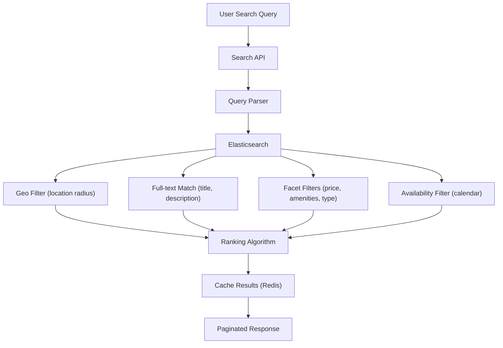
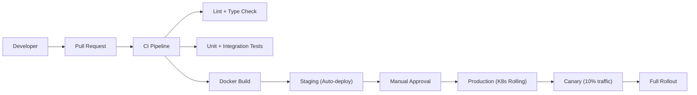

# Production Architecture Diagram - Vacation Rental Marketplace

## High-Level Architecture

---

## Component Details

### Frontend Layer
| Component | Technology | Purpose |
|-----------|-----------|---------|
| **SPA** | React 18 + Next.js | Server-side rendering for SEO, code splitting per route |
| **CDN** | Vercel Edge / CloudFront | Global edge caching, static asset delivery |
| **PWA** | Service Worker | Offline support, push notifications |
| **Image Optimization** | next/image + imgix | Responsive images, WebP/AVIF, lazy loading |

### API Gateway
| Component | Technology | Purpose |
|-----------|-----------|---------|
| **Gateway** | Kong / AWS API Gateway | Request routing, throttling, API versioning |
| **Auth** | JWT + OAuth 2.0 | Token validation, Google/Apple SSO |
| **Rate Limiting** | Redis-backed | Per-user/IP rate limits |

### Microservices
| Service | Tech Stack | Database | Responsibilities |
|---------|-----------|----------|-----------------|
| **Auth** | Node.js/Express | PostgreSQL + Redis | User registration, login, sessions, OAuth |
| **Listing** | Node.js/Express | PostgreSQL + Redis + ES | CRUD listings, availability, pricing rules |
| **Booking** | Node.js/Express | PostgreSQL + Redis | Reservations, calendar blocking, conflict resolution |
| **Search** | Python/FastAPI | Elasticsearch + Redis | Full-text search, geo-search, filtering, ranking |
| **Review** | Node.js/Express | MongoDB + Redis | Reviews, ratings, aggregation |
| **Payment** | Node.js/Express | PostgreSQL | Stripe integration, refunds, payouts |
| **Notification** | Node.js/Worker | Redis (pub/sub) | Email (SendGrid), SMS (Twilio), push |
| **Messaging** | Node.js/WebSocket | MongoDB | Real-time chat between host/guest |
| **Media** | Node.js/Express | S3 metadata in PG | Photo upload, resize, CDN invalidation |

### Data Layer Scaling Strategy

| Layer | Technology | Scaling Strategy |
|-------|-----------|-----------------|
| **Primary DB** | PostgreSQL 16 | Vertical scaling + connection pooling (PgBouncer) |
| **Read Replicas** | PostgreSQL | Horizontal read scaling, 2-4 replicas per region |
| **Cache** | Redis Cluster | 3-node cluster, TTL-based eviction, cache-aside pattern |
| **Search** | Elasticsearch | 3-node cluster, geo-point indexing, relevance tuning |
| **Documents** | MongoDB | Replica set, sharding by user_id for messages |
| **Object Storage** | S3 + CloudFront | Multi-region replication, lifecycle policies |

### Search Architecture

### Deployment & CI/CD

| Infrastructure | Technology | Details |
|---------------|-----------|---------|
| **Container Orchestration** | Kubernetes (EKS) | Auto-scaling, rolling deployments |
| **CI/CD** | GitHub Actions | Automated testing, Docker builds |
| **IaC** | Terraform | Reproducible infrastructure |
| **Secrets** | AWS Secrets Manager | Encrypted credential management |
| **Monitoring** | Datadog + PagerDuty | APM, logs, alerting |

---

## Scaling Milestones

| Users | Strategy |
|-------|----------|
| **0 – 10K** | Monolith on single server, PostgreSQL, Redis cache |
| **10K – 100K** | Separate services, read replicas, CDN, Elasticsearch |
| **100K – 1M** | Kubernetes, multi-region, sharding, message queues |
| **1M+** | Geo-distributed, edge computing, ML-based search ranking |
